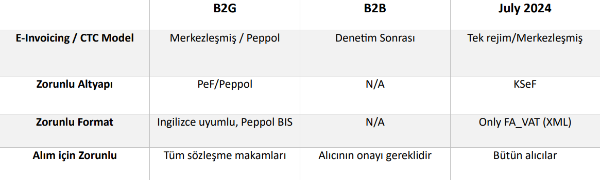

# Giriş

Bu dökümantasyon,

B2B'de [KSeF](https://ksef-test.mf.gov.pl/) (Ulusal e-Fatura Sistemi) ve B2G'de [PEF](https://efaktura.gov.pl/uslugi-pef/)(e-faturalama Platformu) olmak üzere iki büyük temel faturlama platformun çerçevisinde, Polonya e-fatura düzenlemelerine uyum sağlama amacı taşıyan stratejik bir inisiyatiftir.  

Büyük şirketler, güncel olarak sanal ortamda faturalandırma sistemlerinin tamamının değiştirilecek olması dolayısıyla; **1 Temmuz 2024** tarihinde temelli [KSeF VAT(KDV)](https://www.podatki.gov.pl/e-deklaracje/dokumentacja-it/struktury-dokumentow-xml/#ksef) entegrasyonlarının hazırlık aşamalarına başlamış durumdalar.



?> Faturalandırmalarda güncel olarak *elektronik imza zorunluluğu yoktur*.

?> Fatura saklama işlemleri, [entegratörlerin bulutlarında]() 5 yıl, [OSS](https://www.pagero.com/blog/oss-ioss) (One-Stop Shop) şeması altında 10, [KSeF](https://ksef-test.mf.gov.pl/) altında ise 10 yıldır.  

> [OSS](https://www.pagero.com/blog/oss-ioss) nedir? Tek Noktadan Hizmet (OSS) programı, tüm AB Üye Devletlerindeki satışlarda KDV'nin tek bir vergi dairesine ödenmesinin olanağını sağlayan bir programdır.

<h4>PEF ve Peppolün faturalandırmadaki rolü nedir?</h4>

**PEF**, Polonya'da e-faturalandırma süreçlerini düzenlemek ve standartlaştırmak amacıyla oluşturulmuş bir sistemdir. PEF, Polonya'daki ticaret ve işletmeler arasında e-fatura değişimini kolaylaştırmak ve düzenlemek için kullanılır. 

> PEF'in başlıca rolleri:

- **Fatura Standartları ve Formatları** PEF, yukarıda da bahsettiğim e-fatura standartlarını ve formatlarını belirler. Bu sayede faturaların tutarlı bir şekilde oluşturulması ve alınması sağlanır.
- **Fatura Onay ve İşlemleri** PEF, e-faturaların gönderilmesi, alınması, onaylanması ve saklanması gibi işlemleri düzenler.
- **Yasal Uyumluluk** PEF, Polonya'daki e-fatura düzenlemelerine ve yasal gereksinimlerine uyum sağlar.
- **E-İmza ve Güvenlik**  PEF, e-faturaların güvenli bir şekilde imzalanmasını ve iletilmesini destekler.

<br>

**Peppol (Pan-European Public Procurement OnLine)** ise Avrupa'da birçok ülkede e-faturalandırmayı kolaylaştırmak ve sürdürülebilir bir şekilde yapmak amacıyla oluşturulmuş bir platformdur. Polonya da Peppol'u benimsemiş ve bu platform Polonya'da e-faturalandırmada önemli bir rol oynamıştır. 

> Peppol'ün başlıca rolleri:

- **Uluslararası Fatura Değişimi** Peppol, uluslararası düzeyde e-fatura değişimini kolaylaştırır ve standartlarını sağlar.
- **İşletmeler Arası İletişim** Peppol, işletmeler arasında fatura değişimini ve iletişimini hızlandırır ve basitleştirir.
- **Hız ve Verimlilik** Peppol ile e-fatura değişimi daha hızlı ve verimli hale gelir, kağıt tabanlı süreçlere göre avantajlar sunar.
- **Düşük Maliyetler** Peppol, e-fatura değişimini kağıt faturalara göre daha düşük maliyetle gerçekleştirmeyi sağlar.


?> **PEF** platform standardındaki e-fatura belgesi, PEPPOL **İş Birlikte Çalışabilirlik Spesifikasyonları** spesifikasyonunda tanımlanmıştır. [OpenPEPPOL](https://peppol.org/) tarafından yayınlanan açıklamalara göre şu an yürürlükte olan [Avrupa Standartı PEF BIS 3.0](http://docs.peppol.eu/poacc/billing/3.0/) Faturalandırma versiyonu [`UBL 2.1`](https://docs.oasis-open.org/ubl/UBL-2.1.html) üzerine kuruludur. 
  

## Sistem Mimarisi <!-- {docsify-ignore} -->

> Bu kısımda, grafik modellemelerine yer verilmiştir. Sistemin genel işleyici ele alınmış olup, teknik kısımlara yüzeysel olarak [Entegrasyona Genel Bakış](#entegrasyona-genel-bakış) bölümünde ve derinlemesine *dökümantasyon* kısımlarında ele alınmıştır. 

<swimlanes-io> 
title: EDM UYGULAMADA NASIL ÇALIŞMALI?

Tedarikçi => ERP: DATA
note: 
Tedarikçi için uygun bir formatta **fatura veya fatura verileri**

ERP --> Tedarikçi: FEEDBACK

ERP <=> KSeF: API
note:
**KSEF** üzerinde yapılandırılmış e-fatura 


ERP => Alıcı(Ticari Ağ): 
note: 
KSeF faturası ve KSeF numarasına atıfta bulunarak alıcı için uygun bir formatta yapılandırılmış **fatura**
</swimlanes-io> 

Sistem modeli, Tedarikçi veya Müşteri tarafından yetkilendirilmiş bir kuruluş olarak KSeF faturalarını düzenleyen ve alan aracı ek hizmetiyle birlikte mevcut ERP mekanizmalarının sürdürülmesidir. Yukarıdaki modelde bu önemli noktalara değinilmiştir.

# KSeF

`KSeF` (Ulusal e-Fatura Sistemi), faturaların elektronik ortamda düzenlenmesi ve alınmasına yönelik bir platformdur.

**İletişim, sistemin mükellefin bağlamına dayandığı bir süreçtir.** Vergi mükellefinin toplu fatura düzenleme yeteneğine sahip olduğu görülmektedir. Faturaların düzenlenmesinde rol oynayan kuruluş, etkileşimli işlemler için bir varlık olabilir; bu, faturaları alan, düzenleyen veya yetkilendiren kuruluşu içerebilir.

<br>

**Sistem üç alandan oluşur:**

> Aynı anda birçok fatura düzenlemenize olanak tanıyan bir dizi işlemden
oluşan toplu gönderim:
[`%environment_path%/openapi/gtw/svc/api/KSeF-batch.yaml`](#ksef-ek-2-api)

> Kimlik doğrulama gerektirmeden Sisteme erişimi sağlayan genel işlemler:
[`%environment_path%/openapi/gtw/svc/api/KSeF-common.yaml`](#ksef-ek-1-api)

> Kimlik bilgisi yönetimi, hızlı teslimat, faturaları arama ve bunlara erişme:
[`%environment_path%/openapi/gtw/svc/api/KSeF-online.yaml`](#ekler)

## E-fatura   


# PEF 

E-fatura gönderilmesi, sipariş işleme sürecinde diğer belgelerin değişiminden önce yapılmalıdır veya ayrı bir faaliyet oluşturabilir. Faturalandırmalarda `UBL 2.1` sürümü kullanılmaktadır. Bu bölüm teknik bilgi içermektedir.
ve iki faturlandırmadaki 2 ana senaryodan oluşmaktadır:

- Tamamlanan hizmet sunumunun faturalanması.
- Tamamlanan mal teslimatının faturalanması.

<h5>
e-fatura Kullanım Senaryoları 1 - KDV dahil hizmetler için fatura
</h5>

Kullanım durumu, bir faturanın Satıcıdan Alıcıya aktarılmasına ilişkin basit bir senaryo ile ilgilidir. Fatura, KDV oranı da dahil olmak üzere asgari bilgi kümesini içerir.

> En basit durumda Satıcıdan Alıcıya fatura belgesi gönderilebilir ve tek KDV oranıyla hizmet sunumuna ilişkin olabilir. KDV bilgisi satır düzeyinde ve özetlerde belirtilir.

Aşağıdaki grafikte iki şirketin bahsi geçen ticaret senaryosu görselleştirilerek anlatılmak istenmiştir.

<swimlanes-io>
EDM Bilişim Sistemleri -> Lojistik ve Depolama Enstitüsü: ERP Cloudy Abonelik Faturası
Note: Hizmet bedeli için kesilen tek KDV oranlı fatura    

Lojistik ve Depolama Enstitüsü --> EDM Bilişim Sistemleri: **Feedback**
Note: Hizmet bedeli için kesilen faturada feedback olarak Onay veya Red olması durumu   

</swimlanes-io>

?> Satıcı (`AccountingSupplierParty` öğesi tarafından tanımlanır), Alıcı (`AcountingCustomerParty` öğesi tarafından tanımlanır)

?> Alıcı hizmeti alır ve siparişin yerine getirildiğini onaylar, Satıcı, Alıcıya periyodik bir fatura gönderir. Bu sırada:

1. Satıcı, Alıcının hizmet siparişini aldı.
2. Faturada şu bilgiler yer alıyor:
- tek KDV oranı
- belge düzeyinde ödenek (indirim)
- faturanın miktarı toplamı
- banka hesabı ve vade tarihi
- Sözleşme referansı 
- fatura dönemi (faturanın tamamı için)
3- Faturanın bir satırı şunları içerir
- Sipariş edilen hizmetin KDV dahil açıklaması
4- Fatura, minimum düzeyde kod ve kodlama şeması kullanan bir metin açıklamasına dayanmaktadır.

Sonuç olarak, 

> e-fatura mesajının/belgesinin kullanılması satıcıya aşağıdaki konularda destek olur: 
- Fatura oluşturma ve gönderme sürecinin otomatikleştirilmesi, 
- Değer ve miktar toplamlarının doğrulanması, 
- KDV hesaplamasının doğru olmasını sağlamak. 

> e-fatura mesajının/belgesinin kullanılması Alıcıya aşağıdaki konularda destek olur: 
- Faturanın sözleşmeye bağlanması 
- Fatura alma sürecinin otomasyonu
- Fatura işleme otomasyonu (kabul ve muhasebe süreçleri)

?> Bu senaryonun tüm XML dökümantasyonu [EKLER](#ekler) kısmında Ek-1 olarak belirtilmiştir.

<br>

<h5>
e-fatura Kullanım Senaryoları 2 - tamamlanan mal teslimatının faturalanması
</h5>

Kullanım durumu, bir faturanın Satıcıdan Alıcıya aktarılmasına ilişkin basit bir senaryo ile ilgilidir. Fatura, iki KDV oranı dahil olmak üzere minimum bilgi kümesini içerir.

> En basit durumda Satıcıdan Alıcıya fatura belgesi gönderilebilir ve malın iki KDV oranıyla teslimine ilişkin olabilir. KDV bilgisi belge ve belirli satırlar düzeyinde belirtilir.

Aşağıdaki grafikte iki şirketin bahsi geçen ticaret senaryosu görselleştirilerek anlatılmak istenmiştir.

<swimlanes-io>
Lojistik ve Depolama Enstitüsü -> EDM Bilişim Sistemleri: toplu Bilgisayar klavyesi satışı için faturalandırma
Note: Mal bedeli için kesilen iki KDV oranlı fatura    

EDM Bilişim Sistemleri --> Lojistik ve Depolama Enstitüsü: **Feedback**
Note: Mal bedeli için kesilen faturada feedback olarak Onay veya Red olması durumu   

</swimlanes-io>

?> Satıcı ( `AccountingSupplierParty` öğesi tarafından tanımlanır) Alıcı ( `AccountingCustomerParty` öğesi tarafından tanımlanır)

?> Alıcı hizmeti alır ve siparişin yerine getirildiğini onaylar, Satıcı, Alıcıya periyodik bir fatura gönderir. Bu sırada:

1. Satıcı, Alıcının iki tür malın tesliminin siparişini aldı ve yerine getirdi.
2. Fatura aşağıdaki bilgileri içerir:
- iki KDV oranı, 
- Faturanın miktar ve değerinin toplamı 
- Banka hesabı ve ödeme tarihi
- sözleşme referansı
- fatura dönemi (faturanın tamamı için)
3. Sipariş edilen ürünlerin KDV dahil tanımları, adetleri ve birim fiyatlarını içeren iki satırlık bir fatura tanımlandı.
4. Fatura, minimum düzeyde kod ve kodlama şeması kullanan bir metin açıklamasına dayanmaktadır.

Sonuç olarak,

> e-fatura mesajının/belgesinin kullanılması Satıcıya aşağıdaki konularda destek olur: 
- Fatura oluşturma ve gönderme sürecinin otomatikleştirilmesi 
- Değer ve miktar toplamlarının doğrulanması 
- KDV hesaplamasının doğru olmasını sağlamak. 

> e-fatura mesajının/belgesinin kullanılması Alıcıya aşağıdaki konularda destek olur: 
- Faturanın sözleşmeye bağlanması 
- Fatura alma sürecinin otomasyonu
- fatura işleme otomasyonu (kabul ve muhasebe süreçleri)

?> Bu senaryonun tüm XML dökümantasyonu [EKLER](#ekler) kısmında Ek-2 olarak belirtilmiştir.

<h4>Yapının ve veri öğelerinin açıklaması</h4>

Bir fatura belgesinin başlangıcında, aşağıdaki şekilde tanımlanan bir dizi kimlik verisi bulunur

```XML
<cbc:CustomizationID>
urn:cen.eu:en16931:2017#compliant#urn:fdc:peppol.eu:2017:poacc:billing:3.0
</cbc:CustomizationID>
<cbc:ProfileID>urn:fdc:peppol.eu:2017:poacc:billing:01:1.0</cbc:ProfileID> 
<cbc:ID>INVOICE_PEF_1.0</cbc:ID> 
<cbc:IssueDate>2018-03-23</cbc:IssueDate>
<cbc:DueDate>2018-03-23</cbc:DueDate> 
<cbc:InvoiceTypeCode>380</cbc:InvoiceTypeCode> 
<cbc:Note>sicil mahkemesi, kurucu sermaye, işletme sermayesi</cbc:Note>
<cbc:TaxPointDate>2018-03-23</cbc:TaxPointDate> 
<cbc:DocumentCurrencyCode>PLN</cbc:DocumentCurrencyCode> 
<cbc:TaxCurrencyCode>EUR</cbc:TaxCurrencyCode> 
<cbc:AccountingCost>maliyetler 123</cbc:AccountingCost> 
<cbc:BuyerReference>aaa123</cbc:BuyerReference> 
<cac:InvoicePeriod>
<cbc:StartDate>2018-03-01</cbc:StartDate> 
<cbc:EndDate>2018-03-15</cbc:EndDate> 
<cbc:DescriptionCode>35</cbc:DescriptionCode> 
</cac:InvoicePeriod>
```

?> Yukarıda belirtilen elementler ve tanımları

- `CustomizationID` **Mesaj sürümü** spesifikasyon verilerinin uyduğu anlamsal içerik, veri gereksinimleri ve iş kurallarına ilişkin kuralların tam bir açıklamasını içeren spesifikasyonun versiyon 
tanımlayıcısıdır
- `ProfileID` **profil tanımlayıcı** belge tarafından gerçekleştirilen iş sürecinin tanımlayıcısı, burada: faturalama
- `ID` **fatura numarası** faturayı benzersiz bir şekilde tanımlamak için gereken, 2016/112/AB sayılı Direktifin 226(2) Maddesi gerekliliklerine uygun olarak benzersiz, ardışık bir fatura numarası
- `IssueDate` faturanın düzenlenme tarihi
- `DueDate` son ödeme tarihi
- `InvoiceTypeCode` fatura türü tanımlayıcı
- `Note` faturaya ilişkin metinsel açıklamalar - ör. kayıt verileri, ayrılma bilgileri
- `TaxPointDate` faturanın düzenlenme tarihinden farklı ise vergi yükümlülüğünün doğduğu tarih
- `DocumentCurrencyCode` fatura para birimi kodu
- `TaxCurrencyCode` KDV para birimi kodu
- `AccountingCost` muhasebe referans numarası (maliyet kalemi)
- `BuyerReference` alıcı referansı - alıcının dahili amaçlarına yönelik bilgiler
- `InvoicePeriod` tarih tanılama elementi
- `StartDate` fatura döneminin başlangıç tarihi
- `EndDate` fatura döneminin bitiş tarihi
- `DescriptionCode` vergi hesaplama tarihi kodu (UNTDID 2005'e göre)

<h4>Faturayla ilgili belgelere yapılan atıflar</h4>

- Satın alma sipariş numarası 
- Sözleşme numarası 
- Gönderim tavsiye numarası 
- Makbuz numarasının teyidi 
- Satıcıya göre sipariş numarası 
- Teslimat programının numarası 
- Spesifikasyon numarası (ek ürün açıklamasının)

İlgili dokümanların fatura dokümanına ek olarak gösterilmesi mümkündür.

```XML
<cac:OrderReference>
	<cbc:ID>123</cbc:ID> (1)

	<cbc:SalesOrderID>O12345</cbc:SalesOrderID> (2)

</cac:OrderReference>
<cac:BillingReference>
	<cac:InvoiceDocumentReference>
		<cbc:ID>1234</cbc:ID> (3)

		<cbc:IssueDate>2017-06-04</cbc:IssueDate> (4)

	</cac:InvoiceDocumentReference>
</cac:BillingReference>
<cac:DespatchDocumentReference>
	<cbc:ID>1234</cbc:ID> (5)

</cac:DespatchDocumentReference>
<cac:ReceiptDocumentReference>
	<cbc:ID>1234</cbc:ID> (6)

</cac:ReceiptDocumentReference>
<cac:OriginatorDocumentReference>
	<cbc:ID>1234</cbc:ID> (7)

</cac:OriginatorDocumentReference>
<cac:ContractDocumentReference>
	<cbc:ID>Contract321</cbc:ID> (8)

</cac:ContractDocumentReference>
<cac:AdditionalDocumentReference>
	<cbc:ID schemeID=" "
3>1234</cbc:ID> (9)

	<cbc:DocumentTypeCode>270</cbc:DocumentTypeCode> (10)

	<cbc:DocumentDescription> Delivery note </cbc:DocumentDescription> (11)

</cac:AdditionalDocumentReference>
<cac:ProjectReference>
	<cbc:ID>Proj1234</cbc:ID> (12)

</cac:ProjectReference>
```

?> Yukarıda belirtilen elementler ve tanımları

- `OrderReference` `ID` sipariş tanımlayıcı (sayı) 
- `SalesOrderID`  Satıcıya göre sipariş numarası 
- `InvoiceDocumentReference` `ID` önceki faturanın numarası (atıfta bulunulan/ilişkili) 
- `IssueDate` önceki faturanın tarihi (atıfta bulunulan/ilgili) 
- `DespatchDocumentReference` `ID`sevk ihbar belgesinin numarası 
- `ReceiptDocumentReference` `ID`alımı teyit eden belgenin numarası 
- `OriginatorDocumentReference` `ID`bir kamu sözleşmesinin veya faturanın ilgili olduğu bir kısmının yapılmasına ilişkin ihale davet mektubunun numarası/imzası 
- `ContractDocumentReference` `ID` sözleşme numarası 
- teslimatı belgeleyen diğer belge sayısı ve belge tanımlama şemasının tanımlayıcısı 
- `DocumentTypeCode` belge türü kodu (9. öğede belirtilmiştir)
- `DocumentDescription` belge türünün metinsel açıklaması 
- `ProjectReference` `ID`faturanın ilgili olduğu projenin tanımlayıcısı

<h5>Referanslar</h5>

- [Şuanki PEPPOL BIS 3.0 faturalandırma sürümü - 3.0.9](https://docs.peppol.eu/poacc/billing/3.0/)

- [e-faturanın bilgi unsurlarının tam listesi ve bunların nitelikleri bu adreste bulunabilir](https://docs.peppol.eu/poacc/billing/3.0/syntax/ubl-invoice/tree/)

- [`Namespace`'lerin açıklamalarına bu linkten ulaşılabilir](https://docs.oasis-open.org/ubl/os-UBL-2.1/xsd/maindoc/UBL-Invoice-2.1.xsd) 

# Ekler 

# <!-- {docsify-ignore} -->

### KSeF EK-1 API

```yaml
openapi: 3.0.1
info:
  contact:
    email: info.ksef@mf.gov.pl
    name: Info
    url: https://ksef.mf.gov.pl
  description: Krajowy System e-Faktur
  title: KSeF
  version: 2.0.4
externalDocs:
  description: Dökümantasyon
  url: https://www.gov.pl/web/kas/krajowy-system-e-faktur
servers:
- description: Üretim ortamı
  url: https://ksef.mf.gov.pl/api
  variables: {}
- description: Gösteri ortamı
  url: https://ksef-demo.mf.gov.pl/api
  variables: {}
- description: Test ortamı
  url: https://ksef-test.mf.gov.pl/api
  variables: {}
tags:
- description: Ulusal e-Fatura Sistemi
  externalDocs:
    description: Ulusal e-Fatura Sistemi
    url: https://ksef.mf.gov.pl
  name: KSeF
paths:
  /common/Invoice/KSeF:
    post:
      description: KSeF havuzundan bir faturanın aşağıdaki kriterlere dayalı olarak alınması
        KSeF numarasına göre
      operationId: common.invoice.ksef
      requestBody:
        content:
          application/json:
            schema:
              $ref: '#/components/schemas/InvoiceRequestKSeF'
        required: true
      responses:
        "200":
          content:
            application/octet-stream:
              schema:
                type: object
          description: OK
        "400":
          content:
            application/json:
              schema:
                $ref: '#/components/schemas/ExceptionResponse'
          description: Yanlış arama
        "404":
          content:
            application/json: {}
          description: Aranan içerik bulunamadı
      summary: KSeF havuzundan bir fatura indirme - KSeF numarasına dayalı kriterler
      tags:
      - Ortak arayüzler - fatura indirme
  /common/Status/{ReferenceNumber}:
    get:
      description: Toplu işlem durumunu kontrol etme
      operationId: common.status
      parameters:
      - in: path
        name: ReferenceNumber
        required: true
        schema:
          type: string
          pattern: "(20[2-9][0-9]|2[1-9][0-9]{2}|[3-9][0-9]{3})(0[1-9]|1[0-2])(0[1-9]|[1-2][0-9]|3[0-1])-([0-9A-Z]{2})-([0-9A-F]{10})-([0-9A-F]{10})-([0-9A-F]{2})"
      responses:
        "200":
          content:
            application/json:
              schema:
                $ref: '#/components/schemas/StatusResponse'
            application/vnd.v3+json:
              schema:
                $ref: '#/components/schemas/V3_StatusResponse'
          description: OK
        "400":
          content:
            application/json:
              schema:
                $ref: '#/components/schemas/ExceptionResponse'
          description: Yanlış arama
      summary: Toplu işlem durumunu indirmek için ortak arayüz
      tags:
      - Ortak arayüzler - status
  /common/Upo/{ReferenceNumber}/{UpoReferenceNumber}:
    get:
      description: UPO'yu İndirme
      operationId: common.upo
      parameters:
      - in: path
        name: ReferenceNumber
        required: true
        schema:
          type: string
          pattern: "(20[2-9][0-9]|2[1-9][0-9]{2}|[3-9][0-9]{3})(0[1-9]|1[0-2])(0[1-9]|[1-2][0-9]|3[0-1])-([0-9A-Z]{2})-([0-9A-F]{10})-([0-9A-F]{10})-([0-9A-F]{2})"
      - in: path
        name: UpoReferenceNumber
        required: true
        schema:
          type: string
          pattern: "(20[2-9][0-9]|2[1-9][0-9]{2}|[3-9][0-9]{3})(0[1-9]|1[0-2])(0[1-9]|[1-2][0-9]|3[0-1])-([0-9A-Z]{2})-([0-9A-F]{10})-([0-9A-F]{10})-([0-9A-F]{2})"
      responses:
        "200":
          content:
            application/vnd.v3+octet-stream:
              schema:
                type: object
          description: OK
        "400":
          content:
            application/json:
              schema:
                $ref: '#/components/schemas/ExceptionResponse'
          description: Yanlış arama
        "404":
          content:
            application/json: {}
          description: Aranan içerik bulunamadı
      summary: UPO ortak indirme arayüzü
      tags:
      - Ortak arayüzler - UPO
components:
  schemas:
    AnonymousSubjectIdentifierToCompanyType:
      type: object
      allOf:
      - $ref: '#/components/schemas/AnonymousSubjectIdentifierToType'
      - type: object
        properties:
          identifier:
            type: string
            pattern: "[1-9]((\\d[1-9])|([1-9]\\d))\\d{7}"
      required:
      - identifier
    AnonymousSubjectIdentifierToNoneType:
      type: object
      allOf:
      - $ref: '#/components/schemas/AnonymousSubjectIdentifierToType'
    AnonymousSubjectIdentifierToOtherTaxType:
      type: object
      allOf:
      - $ref: '#/components/schemas/AnonymousSubjectIdentifierToType'
      - type: object
        properties:
          identifier:
            type: string
            maxLength: 50
            minLength: 1
      required:
      - identifier
    AnonymousSubjectIdentifierToType:
      type: object
      discriminator:
        mapping:
          none: '#/components/schemas/AnonymousSubjectIdentifierToNoneType'
          onip: '#/components/schemas/AnonymousSubjectIdentifierToCompanyType'
          other: '#/components/schemas/AnonymousSubjectIdentifierToOtherTaxType'
        propertyName: type
      properties:
        type:
          type: string
      required:
      - type
    AnonymousSubjectToType:
      type: object
      properties:
        issuedToIdentifier:
          $ref: '#/components/schemas/AnonymousSubjectIdentifierToType'
        issuedToName:
          $ref: '#/components/schemas/SubjectNameType'
      required:
      - issuedToIdentifier
      - issuedToName
    ExceptionDetailType:
      type: object
      properties:
        exceptionCode:
          type: integer
          format: int32
          minimum: 0
        exceptionDescription:
          type: string
          maxLength: 256
          minLength: 1
      required:
      - exceptionCode
      - exceptionDescription
    ExceptionResponse:
      type: object
      properties:
        exception:
          $ref: '#/components/schemas/ExceptionType'
      required:
      - exception
    ExceptionType:
      type: object
      properties:
        exceptionDetailList:
          type: array
          items:
            $ref: '#/components/schemas/ExceptionDetailType'
          maxItems: 100
          minItems: 1
        referenceNumber:
          type: string
          pattern: "(20[2-9][0-9]|2[1-9][0-9]{2}|[3-9][0-9]{3})(0[1-9]|1[0-2])(0[1-9]|[1-2][0-9]|3[0-1])-([0-9A-Z]{2})-([0-9A-F]{10})-([0-9A-F]{10})-([0-9A-F]{2})"
        serviceCode:
          type: string
          maxLength: 64
          minLength: 1
        serviceCtx:
          type: string
          maxLength: 64
          minLength: 1
        serviceName:
          type: string
          maxLength: 64
          minLength: 1
        timestamp:
          type: string
          format: date-time
      required:
      - exceptionDetailList
      - serviceCode
      - serviceCtx
      - serviceName
      - timestamp
    InvoiceQueryDetailsType:
      type: object
      properties:
        dueValue:
          type: string
          pattern: "(\\-)?\\d{1,10}(\\.\\d{2})?"
        invoiceOryginalNumber:
          type: string
          maxLength: 256
          minLength: 1
        subjectTo:
          $ref: '#/components/schemas/AnonymousSubjectToType'
      required:
      - dueValue
      - invoiceOryginalNumber
      - subjectTo
    InvoiceRequestKSeF:
      type: object
      properties:
        invoiceDetails:
          $ref: '#/components/schemas/InvoiceQueryDetailsType'
        ksefReferenceNumber:
          type: string
          pattern: "([1-9]((\\d[1-9])|([1-9]\\d))\\d{7}|M\\d{9}|[A-Z]{3}\\d{7})-(20[2-9][0-9]|2[1-9][0-9]{2}|[3-9][0-9]{3})(0[1-9]|1[0-2])(0[1-9]|[1-2][0-9]|3[0-1])-([0-9A-F]{6})-?([0-9A-F]{6})-([0-9A-F]{2})"
      required:
      - invoiceDetails
      - ksefReferenceNumber
    StatusResponse:
      type: object
      properties:
        processingCode:
          type: integer
          format: int32
          maximum: 999
          minimum: 100
        processingDescription:
          type: string
          maxLength: 256
          minLength: 1
        referenceNumber:
          type: string
          pattern: "(20[2-9][0-9]|2[1-9][0-9]{2}|[3-9][0-9]{3})(0[1-9]|1[0-2])(0[1-9]|[1-2][0-9]|3[0-1])-([0-9A-Z]{2})-([0-9A-F]{10})-([0-9A-F]{10})-([0-9A-F]{2})"
        timestamp:
          type: string
          format: date-time
        upo:
          type: string
          format: binary
      required:
      - processingCode
      - processingDescription
      - referenceNumber
      - timestamp
    SubjectFullNameType:
      type: object
      allOf:
      - $ref: '#/components/schemas/SubjectNameType'
      - type: object
        properties:
          fullName:
            type: string
            maxLength: 256
            minLength: 1
      required:
      - fullName
    SubjectNameType:
      type: object
      discriminator:
        mapping:
          fn: '#/components/schemas/SubjectFullNameType'
          none: '#/components/schemas/SubjectNoneType'
          pn: '#/components/schemas/SubjectPersonNameType'
        propertyName: type
      properties:
        tradeName:
          type: string
          maxLength: 256
          minLength: 1
          nullable: true
        type:
          type: string
      required:
      - type
    SubjectNoneType:
      type: object
      allOf:
      - $ref: '#/components/schemas/SubjectNameType'
    SubjectPersonNameType:
      type: object
      allOf:
      - $ref: '#/components/schemas/SubjectNameType'
      - type: object
        properties:
          firstName:
            type: string
            maxLength: 30
            minLength: 1
          surname:
            type: string
            maxLength: 81
            minLength: 1
      required:
      - firstName
      - surname
    V3_StatusResponse:
      type: object
      properties:
        processingCode:
          type: integer
          format: int32
          maximum: 999
          minimum: 100
        processingDescription:
          type: string
          maxLength: 256
          minLength: 1
        referenceNumber:
          type: string
          pattern: "(20[2-9][0-9]|2[1-9][0-9]{2}|[3-9][0-9]{3})(0[1-9]|1[0-2])(0[1-9]|[1-2][0-9]|3[0-1])-([0-9A-Z]{2})-([0-9A-F]{10})-([0-9A-F]{10})-([0-9A-F]{2})"
        timestamp:
          type: string
          format: date-time
        upoReferenceNumber:
          type: string
          pattern: "(20[2-9][0-9]|2[1-9][0-9]{2}|[3-9][0-9]{3})(0[1-9]|1[0-2])(0[1-9]|[1-2][0-9]|3[0-1])-([0-9A-Z]{2})-([0-9A-F]{10})-([0-9A-F]{10})-([0-9A-F]{2})"
        upoUrl:
          type: string
          maxLength: 512
          minLength: 1
          pattern: "http[s]?:\\/{2}([0-9a-z][0-9a-z_-]*\\.)+[0-9a-z][0-9a-z_-]*(([0-9a-zA-Z][0-9a-zA-Z_-]*\\\
            .?)*\\/?)*"
      required:
      - processingCode
      - processingDescription
      - referenceNumber
      - timestamp
```

### KSeF EK-2 API

[Ek-1](#dokümantasyon-yapısı) Hizmetlere ilişkin fatura belgesi örneği:

```XML
<?xml version="1.0" encoding="UTF-8"?>
<Invoice
	xmlns="urn:oasis:names:specification:ubl:schema:xsd:Invoice-2"
	xmlns:cac="urn:oasis:names:specification:ubl:schema:xsd:CommonAggregateComponents-2"
	xmlns:cbc="urn:oasis:names:specification:ubl:schema:xsd:CommonBasicComponents-2"
	xmlns:ccts="urn:un:unece:uncefact:documentation:2"
	xmlns:qdt="urn:oasis:names:specification:ubl:schema:xsd:QualifiedDatatypes-2"
	xmlns:udt="urn:un:unece:uncefact:data:specification:UnqualifiedDataTypesSchemaModule:2">
	<cbc:CustomizationID>
urn:cen.eu:en16931:2017#compliant#urn:fdc:peppol.eu:2017:poacc:billing:3.0
</cbc:CustomizationID>
	<cbc:ProfileID>urn:fdc:peppol.eu:2017:poacc:billing:01:1.0</cbc:ProfileID>
	<cbc:ID>INVOICE_PeF_1.0</cbc:ID>
	<cbc:IssueDate>2018-04-10</cbc:IssueDate>
	<cbc:DueDate>2018-04-23</cbc:DueDate>
	<cbc:InvoiceTypeCode>380</cbc:InvoiceTypeCode>
	<cbc:Note>Sözleşme internet sitesi üzerinden imzalandı</cbc:Note>
	<cbc:DocumentCurrencyCode>PLN</cbc:DocumentCurrencyCode>
	<cac:InvoicePeriod>
		<cbc:StartDate>2018-01-01</cbc:StartDate>
		<cbc:EndDate>2018-03-31</cbc:EndDate>
		<cbc:DescriptionCode>35</cbc:DescriptionCode>
	</cac:InvoicePeriod>
	<cac:OrderReference>
		<cbc:ID>Z123</cbc:ID>
	</cac:OrderReference>
	<cac:ContractDocumentReference>
		<cbc:ID>K571/2018</cbc:ID>
		<cbc:DocumentType>Sözleşme</cbc:DocumentType>
	</cac:ContractDocumentReference>
	<cac:AccountingSupplierParty>
		<cac:Party>
			<cbc:EndpointID schemeID="0088">5790989675432</cbc:EndpointID>
			<cac:PartyName>
				<cbc:Name>EDM</cbc:Name>
			</cac:PartyName>
			<cac:PostalAddress>
				<cbc:StreetName>Cumhuriyet Mah.</cbc:StreetName>
				<cbc:CityName>İstanbul</cbc:CityName>
				<cbc:PostalZone>61-693</cbc:PostalZone>
				<cac:Country>
					<cbc:IdentificationCode>PL</cbc:IdentificationCode>
				</cac:Country>
			</cac:PostalAddress>
			<cac:PartyTaxScheme>
				<cbc:CompanyID>PL5260207427</cbc:CompanyID>
				<cac:TaxScheme>
					<cbc:ID>KDV</cbc:ID>
				</cac:TaxScheme>
			</cac:PartyTaxScheme>
			<cac:PartyLegalEntity>
				<cbc:RegistrationName>EDM Bilişim Sis.ve Dan. Hiz. A.Ş.</cbc:RegistrationName>
				<cbc:CompanyID>011518197</cbc:CompanyID>
			</cac:PartyLegalEntity>
			<cac:Contact>
				<cbc:ElectronicMail>edm@info.tr</cbc:ElectronicMail>
			</cac:Contact>
		</cac:Party>
	</cac:AccountingSupplierParty>
	<cac:AccountingCustomerParty>
		<cac:Party>
			<cbc:EndpointID schemeID="0088">5790000435975</cbc:EndpointID>
			<cac:PartyName>
				<cbc:Name>Lojistik ve Depolama Enstitüsü</cbc:Name>
			</cac:PartyName>
			<cac:PostalAddress>
				<cbc:StreetName>Estkowskiego 6</cbc:StreetName>
				<cbc:CityName>Poznań</cbc:CityName>
				<cbc:PostalZone>61-755</cbc:PostalZone>
				<cac:Country>
					<cbc:IdentificationCode>PL</cbc:IdentificationCode>
				</cac:Country>
			</cac:PostalAddress>
			<cac:PartyLegalEntity>
				<cbc:RegistrationName>Nazwa firmy</cbc:RegistrationName>
				<cbc:CompanyID>540269750</cbc:CompanyID>
			</cac:PartyLegalEntity>
		</cac:Party>
	</cac:AccountingCustomerParty>
	<cac:PaymentMeans>
		<cbc:PaymentMeansCode name="Tekst opisowy">42</cbc:PaymentMeansCode>
		<cbc:PaymentID>Płatność1</cbc:PaymentID>
		<cac:PayeeFinancialAccount>
			<cbc:ID schemeID="LOCAL">39109013620000000036017908</cbc:ID>
		</cac:PayeeFinancialAccount>
	</cac:PaymentMeans>
	<cac:AllowanceCharge>
		<cbc:ChargeIndicator>true</cbc:ChargeIndicator>
		<cbc:AllowanceChargeReasonCode>ABL</cbc:AllowanceChargeReasonCode>
		<cbc:AllowanceChargeReason>Paketleme maliyetleri</cbc:AllowanceChargeReason>
		<cbc:Amount currencyID="PLN">100.00</cbc:Amount>
		<cac:TaxCategory>
			<cbc:ID>S</cbc:ID>
			<cbc:Percent>8</cbc:Percent>
			<cac:TaxScheme>
				<cbc:ID>VAT</cbc:ID>
			</cac:TaxScheme>
		</cac:TaxCategory>
	</cac:AllowanceCharge>
	<cac:TaxTotal>
		<cbc:TaxAmount currencyID="PLN">40.00</cbc:TaxAmount>
		<cac:TaxSubtotal>
			<cbc:TaxableAmount currencyID="PLN">800.00</cbc:TaxableAmount>
			<cbc:TaxAmount currencyID="PLN">40.00</cbc:TaxAmount>
			<cac:TaxCategory>
				<cbc:ID>S</cbc:ID>
				<cbc:Percent>5</cbc:Percent>
				<cac:TaxScheme>
					<cbc:ID>VAT</cbc:ID>
				</cac:TaxScheme>
			</cac:TaxCategory>
		</cac:TaxSubtotal>
	</cac:TaxTotal>
	<cac:LegalMonetaryTotal>
		<cbc:LineExtensionAmount currencyID="PLN">800.00</cbc:LineExtensionAmount>
		<cbc:TaxExclusiveAmount currencyID="PLN">900.00</cbc:TaxExclusiveAmount>
		<cbc:TaxInclusiveAmount currencyID="PLN">940.00</cbc:TaxInclusiveAmount>
		<cbc:ChargeTotalAmount currencyID="PLN">100.00</cbc:ChargeTotalAmount>
		<cbc:PayableAmount currencyID="PLN">940.00</cbc:PayableAmount>
	</cac:LegalMonetaryTotal>
	<cac:InvoiceLine>
		<cbc:ID>1</cbc:ID>
		<cbc:InvoicedQuantity unitCode="C62">1</cbc:InvoicedQuantity>
		<cbc:LineExtensionAmount currencyID="PLN">800.00</cbc:LineExtensionAmount>
		<cac:Item>
			<cbc:Description>2018'in ilk çeyreğinde basın aboneliği</cbc:Description>
			<cbc:Name>Basın aboneliği</cbc:Name>
			<cac:ClassifiedTaxCategory>
				<cbc:ID>S</cbc:ID>
				<cbc:Percent>5</cbc:Percent>
				<cac:TaxScheme>
					<cbc:ID>KDV</cbc:ID>
				</cac:TaxScheme>
			</cac:ClassifiedTaxCategory>
		</cac:Item>
		<cac:Price>
			<cbc:PriceAmount currencyID="PLN">800.00</cbc:PriceAmount>
		</cac:Price>
	</cac:InvoiceLine>
</Invoice>
```

<br>

[Ek-2](#dokümantasyon-yapısı) tamamlanan mal teslimatına ilişkin fatura belgesi örneği:

```XML
<?xml version="1.0" encoding="UTF-8"?>
<Invoice
	xmlns="urn:oasis:names:specification:ubl:schema:xsd:Invoice-2"
	xmlns:cac="urn:oasis:names:specification:ubl:schema:xsd:CommonAggregateComponents-2"
	xmlns:cbc="urn:oasis:names:specification:ubl:schema:xsd:CommonBasicComponents-2"
	xmlns:ccts="urn:un:unece:uncefact:documentation:2"
	xmlns:qdt="urn:oasis:names:specification:ubl:schema:xsd:QualifiedDatatypes-2"
	xmlns:udt="urn:un:unece:uncefact:data:specification:UnqualifiedDataTypesSchemaModule:2">
	<cbc:CustomizationID>
urn:cen.eu:en16931:2017#compliant#urn:fdc:peppol.eu:2017:poacc:billing:3.0
</cbc:CustomizationID>
	<cbc:ProfileID>urn:fdc:peppol.eu:2017:poacc:billing:01:1.0</cbc:ProfileID>
	<cbc:ID>TOSL110</cbc:ID>
	<cbc:IssueDate>2018-04-10</cbc:IssueDate>
	<cbc:DueDate>2018-04-23</cbc:DueDate>
	<cbc:InvoiceTypeCode>380</cbc:InvoiceTypeCode>
	<cbc:Note>Sözleşme internet sitesi üzerinden imzalandı</cbc:Note>
	<cbc:DocumentCurrencyCode>PLN</cbc:DocumentCurrencyCode>
	<cac:OrderReference>
		<cbc:ID>Z123</cbc:ID>
	</cac:OrderReference>
	<cac:AccountingSupplierParty>
		<cac:Party>
			<cbc:EndpointID schemeID="0088">5790000436101</cbc:EndpointID>
			<cac:PartyName>
				<cbc:Name>Empik</cbc:Name>
			</cac:PartyName>
			<cac:PostalAddress>
				<cbc:StreetName>Dróżbickiego 2</cbc:StreetName>
				<cbc:CityName>Poznań</cbc:CityName>
				<cbc:PostalZone>61-693</cbc:PostalZone>
				<cac:Country>
					<cbc:IdentificationCode>PL</cbc:IdentificationCode>
				</cac:Country>
			</cac:PostalAddress>
			<cac:PartyTaxScheme>
				<cbc:CompanyID>PL5260207427</cbc:CompanyID>
				<cac:TaxScheme>
					<cbc:ID>VAT</cbc:ID>
				</cac:TaxScheme>
			</cac:PartyTaxScheme>
			<cac:PartyLegalEntity>
				<cbc:RegistrationName>Empik Sp. z o.o.</cbc:RegistrationName>
				<cbc:CompanyID>PL0001151819</cbc:CompanyID>
			</cac:PartyLegalEntity>
			<cac:Contact>
				<cbc:Name>İsim soyisim</cbc:Name>
				<cbc:Telephone>+4898989898</cbc:Telephone>
				<cbc:ElectronicMail>office@empik.pl</cbc:ElectronicMail>
			</cac:Contact>
		</cac:Party>
	</cac:AccountingSupplierParty>
	<cac:AccountingCustomerParty>
		<cac:Party>
			<cbc:EndpointID schemeID="0088">5790000436057</cbc:EndpointID>
			<cac:PartyName>
				<cbc:Name>Lojistik ve Depolama Enstitüsü</cbc:Name>
			</cac:PartyName>
			<cac:PostalAddress>
				<cbc:StreetName>Estkowskiego 6</cbc:StreetName>
				<cbc:CityName>Poznań</cbc:CityName>
				<cbc:PostalZone>61-755</cbc:PostalZone>
				<cac:Country>
					<cbc:IdentificationCode>PL</cbc:IdentificationCode>
				</cac:Country>
			</cac:PostalAddress>
			<cac:PartyLegalEntity>
				<cbc:RegistrationName>Łukasiewicz Araştırma Ağı. Lojistik ve Depolama Enstitüsü</cbc:RegistrationName>
			</cac:PartyLegalEntity>
			<cac:Contact>
				<cbc:Name>İsim soyisim</cbc:Name>
			</cac:Contact>
		</cac:Party>
	</cac:AccountingCustomerParty>
	<cac:Delivery>
		<cbc:ActualDeliveryDate>2018-04-15</cbc:ActualDeliveryDate>
		<cac:DeliveryLocation>
			<cac:Address>
				<cbc:StreetName>Estkowskiego 6</cbc:StreetName>
				<cbc:CityName>Poznań</cbc:CityName>
				<cbc:PostalZone>61-755</cbc:PostalZone>
				<cac:Country>
					<cbc:IdentificationCode>PL</cbc:IdentificationCode>
				</cac:Country>
			</cac:Address>
		</cac:DeliveryLocation>
	</cac:Delivery>
	<cac:PaymentMeans>
		<cbc:PaymentMeansCode name="Tekstopisowy">42</cbc:PaymentMeansCode>
		<cbc:PaymentID>Płatność2</cbc:PaymentID>
		<cac:PayeeFinancialAccount>
			<cbc:ID schemeID="LOCAL">39109013620000000036017908</cbc:ID>
			<cbc:Name>Konto dla płatności</cbc:Name>
		</cac:PayeeFinancialAccount>
	</cac:PaymentMeans>
	<cac:TaxTotal>
		<cbc:TaxAmount currencyID="PLN">345.00</cbc:TaxAmount>
		<cac:TaxSubtotal>
			<cbc:TaxableAmount currencyID="PLN">1500.00</cbc:TaxableAmount>
			<cbc:TaxAmount currencyID="PLN">345.00</cbc:TaxAmount>
			<cac:TaxCategory>
				<cbc:ID>S</cbc:ID>
				<cbc:Percent>23</cbc:Percent>
				<cac:TaxScheme>
					<cbc:ID>VAT</cbc:ID>
				</cac:TaxScheme>
			</cac:TaxCategory>
		</cac:TaxSubtotal>
	</cac:TaxTotal>
	<cac:LegalMonetaryTotal>
		<cbc:LineExtensionAmount currencyID="PLN">1500.00</cbc:LineExtensionAmount>
		<cbc:TaxExclusiveAmount currencyID="PLN">1500.00</cbc:TaxExclusiveAmount>
		<cbc:TaxInclusiveAmount currencyID="PLN">1845.00</cbc:TaxInclusiveAmount>
		<cbc:PayableAmount currencyID="PLN">1845.00</cbc:PayableAmount>
	</cac:LegalMonetaryTotal>
	<cac:InvoiceLine>
		<cbc:ID>1</cbc:ID>
		<cbc:InvoicedQuantity unitCode="C62">1000</cbc:InvoicedQuantity>
		<cbc:LineExtensionAmount currencyID="PLN">1000.00</cbc:LineExtensionAmount>
		<cac:Item>
			<cbc:Description>A4 yazıcı kağıdı, 2mm</cbc:Description>
			<cbc:Name>Papier A4</cbc:Name>
			<cac:SellersItemIdentification>
				<cbc:ID>JB007</cbc:ID>
			</cac:SellersItemIdentification>
			<cac:ClassifiedTaxCategory>
				<cbc:ID>S</cbc:ID>
				<cbc:Percent>23</cbc:Percent>
				<cac:TaxScheme>
					<cbc:ID>VAT</cbc:ID>
				</cac:TaxScheme>
			</cac:ClassifiedTaxCategory>
		</cac:Item>
		<cac:Price>
			<cbc:PriceAmount currencyID="PLN">1.00</cbc:PriceAmount>
		</cac:Price>
	</cac:InvoiceLine>
	<cac:InvoiceLine>
		<cbc:ID>2</cbc:ID>
		<cbc:InvoicedQuantity unitCode="C62">100</cbc:InvoicedQuantity>
		<cbc:LineExtensionAmount currencyID="PLN">500.00</cbc:LineExtensionAmount>
		<cac:Item>
			<cbc:Description>Siyah mürekkepli tükenmez kalem</cbc:Description>
			<cbc:Name>XXL tükenmez kalem</cbc:Name>
			<cac:SellersItemIdentification>
				<cbc:ID>JB008</cbc:ID>
			</cac:SellersItemIdentification>
			<cac:ClassifiedTaxCategory>
				<cbc:ID>S</cbc:ID>
				<cbc:Percent>23</cbc:Percent>
				<cac:TaxScheme>
					<cbc:ID>VAT</cbc:ID>
				</cac:TaxScheme>
			</cac:ClassifiedTaxCategory>
		</cac:Item>
		<cac:Price>
			<cbc:PriceAmount currencyID="PLN">5.00</cbc:PriceAmount>
		</cac:Price>
	</cac:InvoiceLine>
</Invoice>

```

# Versiyon Kontrol
`1.1`

- **11/10/2023 API Bölümlerinin tanımlanması theme'in değiştirilmesi: _BURAK BILEN_**

`1.0` 

- **11/02/2023 BETA dökümantasyonun oluşturulması _BURAK BILEN_**

